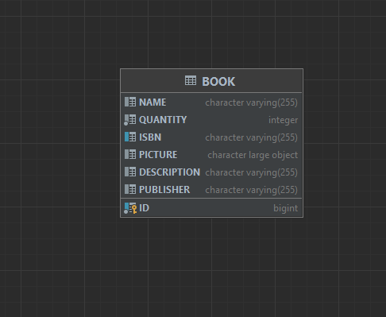

# Fake Amazon Bookstore #

## Project Description ##
Bookstore Owner can upload and edit Book information (ISBN, picture, description, author, publisher,...) and inventory. User can search for, and browse through, the books in the bookstore, sort/filter them based on the above information. User can then decide to purchase one or many books by putting them in the Shopping Cart and proceeding to Checkout. The purchase itself will obviously be simulated, but purchases cannot exceed the inventory. User can also view Book Recommendations based on past purchases. This is done by looking for users whose purchases are most similar (using Jaccard distance: Google it!), and then recommending books purchased by those similar users but that the current User hasn't yet purchased.

## Database schema ##

## Current State of Project ##
Currently, the bookstore admin page has the abilty to upload a new book,
and the ability to view all the books currently stored.

## Milestones ##
Milestone 1: Early prototype. Give a 10-15 minute demo during the lab on March 8h.
For this milestone we are looking to see enough functionality to get a feel for the system and how it will
work. One important use case should be operational. It should collect data from the back end, do
something with it and display the result. The display doesn't need to be fancy. There should be a GitHub
repo, integrated with CI Cloning the repo and running the pom.xml should provide us with a ready-to-run JAR file.
We will also inspect the README file, the Issues, the Kanban, the code reviews, the tests, and we will
verify that everybody is participating in all aspects of the project (if that is not the case, different team
members will end up with different grades).

Milestone 2: Alpha Release. Give a 10-15 minute demo during the lab on March 22th.
For the alpha release your system should be somewhat usable, although not feature-complete. This
means that a user should be able to use several related features of the app and do something reasonably
useful. The README on GitHub must be updated with a plan for the next sprint.

Milestone 3 - Final demo. Project complete. Give a 10-15 minute demo during the lab on April 5th.
For the final sprint of your project you must decide on the final scope of the product: a set of features
that can be implemented within the given timeline and makes the product usable and useful. The user
interface should not have any dangling links to non-implemented features.